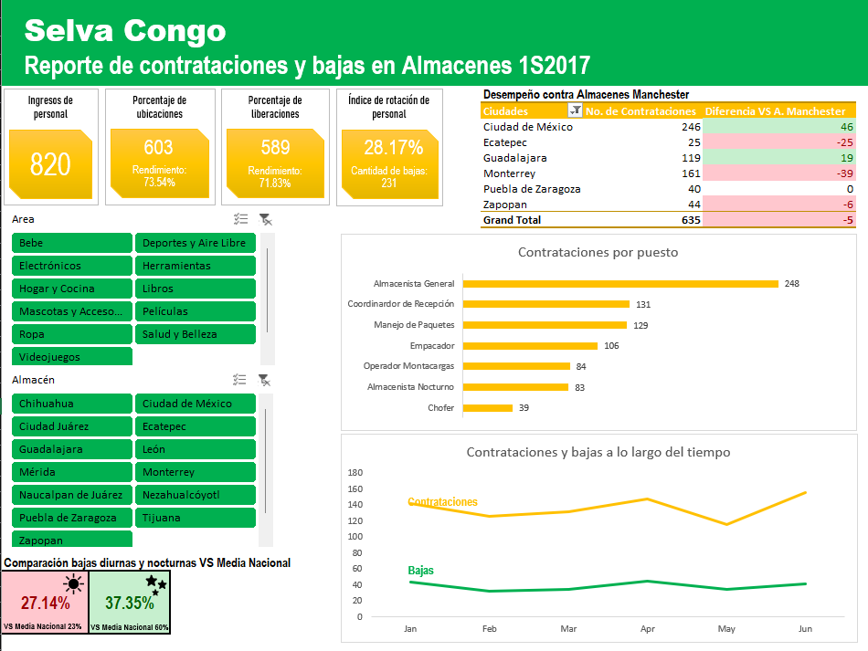

# Dashboards en Excel

Este repositorio presenta una colección de dashboards interactivos desarrollados en Excel como parte de ejercicios prácticos de análisis de datos. **Todas las situaciones descritas son simuladas** y fueron diseñadas con fines educativos y de desarrollo profesional. No representan experiencias laborales reales.
Cada proyecto parte de un escenario específico y propone una solución visual que permite explorar la información de forma clara, funcional y adaptable a distintos perfiles de usuario.

---
## ¿Qué encontrarás aquí?

- Dashboards en español, creados a partir de ejercicios independientes.
- Imágenes o Gifs que muestran la estructura y funcionalidad (incluyendo el efecto de los slicers).
- Breves descripciones de cada proyecto, con enfoque en el análisis realizado.
---

### Proyecto 1: Dashboard de Recursos Humanos – Selva Congo
**Escenario simulado:** 
Como analista recién incorporada al departamento de Recursos Humanos de SelvaCongo, se me encomendó rediseñar la forma en que se presenta la información sobre contrataciones y bajas del personal de almacén a nivel nacional. El analista anterior dedicaba más de la mitad de su tiempo mensual a generar reportes manuales en PowerPoint para **143 gerentes y jefes de operación**.

**Objetivo:**
Diseñar un dashboard interactivo en Excel que permita a los gerentes consultar de forma autónoma los indicadores clave relacionados con la rotación de personal, mejorando la eficiencia del área y facilitando la toma de decisiones.

**Elementos incluidos en el dashboard:**
- Cantidad de ingresos
- Cantidad de ubicaciones /rendimiento como porcentaje de ingresos
- Cantidad de liberaciones/ rendimiento como porcentaje de ingresos
- Índice de rotación de personal (definido como bajas sobre ingresos)
- 2 gráficas
- 2 segmentadores
- 1 tabla

**Información adicional considerada:**
- Objetivo de Dirección: superar la media de la industria en todos los indicadores logísticos.
- Datos comparativos de contrataciones en **Tiendas Manchester** (competencia) durante el primer semestre de 2017.
- Impacto de la **inseguridad** en las contrataciones.
- Medias de rotación en la industria:
  - Turno nocturno: **60%**
  - Turno diurno: **23%**

**Tratamiento de datos:**
Los datos fueron simulados y contenían inconsistencias y formatos mixtos. Se realizó limpieza, normalización de campos y creación de métricas derivadas. 

Este proyecto fue desarrollado con base en documentos internos simulados, incluyendo boletines, correos y reportes de otras áreas, para contextualizar las necesidades del negocio.

---

## 📄 Licencia

Este repositorio está bajo la licencia [CC BY-NC 4.0](https://creativecommons.org/licenses/by-nc/4.0/). Puedes reutilizar y modificar el contenido con atribución, pero no con fines comerciales.
