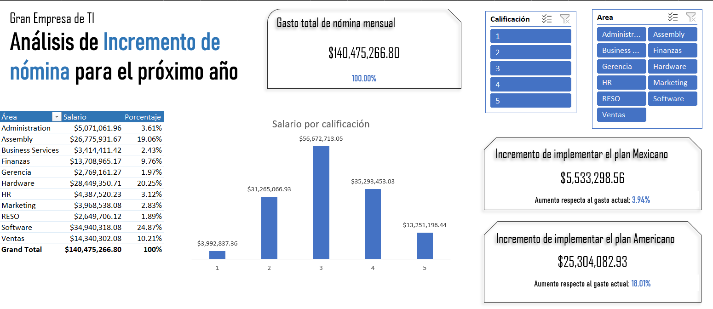

# Dashboards en Excel

This repository showcases interactive Excel dashboards designed for reporting and process analysis.
All scenarios are simulated and created for educational and professional development purposes.
Documentation is in Spanish, but the structure and visuals are intuitive and easy to follow.
Tools used include Excel, with dynamic elements such as slicers, charts, and calculated metrics.

Este repositorio presenta una colección de dashboards interactivos desarrollados en Excel como parte de ejercicios prácticos de análisis de datos. **Todas las situaciones descritas son simuladas** y fueron diseñadas con fines educativos y de desarrollo profesional. No representan experiencias laborales reales.
Cada proyecto parte de un escenario específico y propone una solución visual que permite explorar la información de forma clara, funcional y adaptable a distintos perfiles de usuario.

---
## ¿Qué encontrarás aquí?

- Dashboards en español, creados a partir de ejercicios independientes.
- Imágenes o Gifs que muestran la estructura y funcionalidad (incluyendo el efecto de los slicers).
- Breves descripciones de cada proyecto, con enfoque en el análisis realizado.
---

### Proyecto 2: Dashboard de Nómina – Gran Empresa de TI
Este dashboard fue diseñado para evaluar dos escenarios salariales en una empresa global de TI, considerando restricciones legales mexicanas y prácticas internacionales. El análisis permite tomar decisiones informadas sobre aumentos y despidos, con visuales claros y segmentación dinámica.

**Escenario simulado:**
Como analista de nómina en la división mexicana de una empresa global de tecnología, se me pidió evaluar dos propuestas de aumento salarial para el próximo año. Los gerentes locales proponían un aumento igualitario para todos los empleados, mientras que los vicepresidentes en Estados Unidos sugerían un modelo basado en desempeño, inspirado en prácticas de la competencia.

**Descripción de los planes evaluados:**
*Plan Mexicano:*
Aumento salarial igual para todos los empleados, sin despidos. Se aplican porcentajes estándar por concepto (salario base, bonos, vales, etc.) sin distinción por desempeño.
*Plan Americano:*
Despido inmediato de empleados con calificación de desempeño igual a 1, con cálculo de indemnización conforme a la Ley Federal del Trabajo. Los empleados con calificación 4 y 5 reciben el doble del aumento estándar. Los demás reciben el aumento normal.

**Objetivo:**
Diseñar una herramienta interactiva que permita comparar el impacto económico de ambos planes, visualizar los costos por área y por nivel de desempeño, y facilitar la toma de decisiones estratégicas.

**Elementos incluidos en el dashboard:**
- Gasto total de nómina actual (todos los conceptos)
- Costo de implementar el plan americano (en dólares y porcentaje)
- Costo de implementar el plan mexicano (en dólares y porcentaje)
- Gráfica de costos actuales por calificación de desempeño
- Tabla de costos actuales por área (en dólares y porcentaje)
- 2 segmentadores: por grado de evaluación y por área

**Tratamiento de datos:**
Se aplicó limpieza de errores en bandas y categorías, normalización de campos, y cálculo de indemnizaciones conforme al Artículo 50 de la Ley Federal del Trabajo. El dashboard se diseñó para actualizarse dinámicamente con nuevos datos.

---
### Proyecto 1: Dashboard de Recursos Humanos – Selva Congo
**Escenario simulado:** 
Como analista recién incorporada al departamento de Recursos Humanos de SelvaCongo, se me encomendó rediseñar la forma en que se presenta la información sobre contrataciones y bajas del personal de almacén a nivel nacional. El analista anterior dedicaba más de la mitad de su tiempo mensual a generar reportes manuales en PowerPoint para **143 gerentes y jefes de operación**.

**Objetivo:**
Diseñar un dashboard interactivo en Excel que permita a los gerentes consultar de forma autónoma los indicadores clave relacionados con la rotación de personal, mejorando la eficiencia del área y facilitando la toma de decisiones.

**Elementos incluidos en el dashboard:**
- Cantidad de ingresos
- Cantidad de ubicaciones /rendimiento como porcentaje de ingresos
- Cantidad de liberaciones/ rendimiento como porcentaje de ingresos
- Índice de rotación de personal (definido como bajas sobre ingresos)
- 2 gráficas
- 2 segmentadores
- 1 tabla

**Información adicional considerada:**
- Objetivo de Dirección: superar la media de la industria en todos los indicadores logísticos.
- Datos comparativos de contrataciones en **Tiendas Manchester** (competencia) durante el primer semestre de 2017.
- Impacto de la **inseguridad** en las contrataciones.
- Medias de rotación en la industria:
  - Turno nocturno: **60%**
  - Turno diurno: **23%**

**Tratamiento de datos:**
Los datos fueron simulados y contenían inconsistencias y formatos mixtos. Se realizó limpieza, normalización de campos y creación de métricas derivadas. 

Este proyecto fue desarrollado con base en documentos internos simulados, incluyendo boletines, correos y reportes de otras áreas, para contextualizar las necesidades del negocio.

---

## 📄 Licencia

Este repositorio está bajo la licencia [CC BY-NC 4.0](https://creativecommons.org/licenses/by-nc/4.0/). Puedes reutilizar y modificar el contenido con atribución, pero no con fines comerciales.
